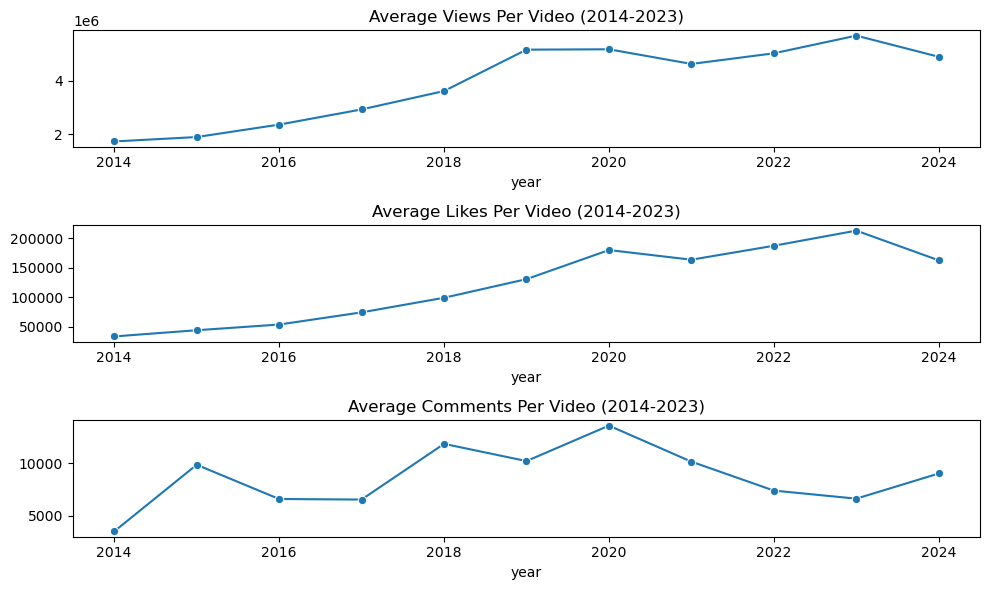

# Enhancing YouTube Engagement: Analyzing Marques Brownlee (MKBHD) Channel (2014-2023)

## Background and Overview

### Project Context:
This project analyzes video performance and audience engagement on Marques Brownlee's (MKBHD) YouTube channel from 2014 to 2023. The goal is to uncover patterns in video views, likes, comments, and keywords that drive higher engagement, providing insights for content optimization. The project leverages data from the YouTube Data API, exploring how factors like content focus, timing, and video topics impact overall audience interaction.

### Main Goal:
To analyze engagement trends and provide actionable insights that help content creators maximize engagement by optimizing video topics, timing, and content strategies.

### Key Metrics:
- Total views per video
- Total likes per video
- Total comments per video
- Engagement ratios (likes per view, comments per view)

### Data Sources:
Data was gathered using the YouTube Data API and included metadata such as video titles, descriptions, published dates, views, likes, and comments. The dataset consists of around 1600 videos from MKBHD's channel.

### Tools Used:
- Python (Pandas, NumPy, Requests, Matplotlib, Seaborn, SciPy, Scikit-learn, NLTK, WordCloud) for [Data Collection](https://github.com/nacin023/youtube_engagement_analysis/blob/main/1_data_collection.ipynb) and [Preprocessing & Exploratory Data Analysis](https://github.com/nacin023/youtube_engagement_analysis/blob/main/2_preprocessing_and_eda.ipynb)

---

## Data Structure Overview

### Dataset Summary:
The dataset includes the following key columns:
- `title`: Title of the video.
- `description`: Description provided of the video
- `views`: Total number of views per video.
- `likes`: Total number of likes per video.
- `comments`: Total number of comments per video.
- `published_at`: Date when the video was published.
  
Additional features were derived such as title length, description length, giveaway indicator, and engagement ratios (likes per view, comments per view) were created during the preprocessing phase.

---

## Executive Summary

### Key Insights Summary:
1. **Skewed Engagement**: A few viral videos drive the bulk of engagement across views, likes, and comments. 
2. **Content Focus**: Apple-related content continues to drive significant viewership, with the words 'Apple' and 'iPhone' appearing in top-performing videos.
3. **Engagement Plateau**: While views have continued to grow, likes and comments show signs of leveling off since 2021.
4. **High-Engagement Days**: Fridays seem to be the most common day for posting top-performing videos, with 9 AM and 8 PM being optimal posting times.

### Key Performance Metrics:
- **Average views per video**: 3.99 million
- **Average likes per video**: 124,411
- **Average comments per video**: 8,790
- **Year-over-year growth in views**: 225% from 2014 to 2023
- **Growth in the last 3 years**: 
  - **Views**: Increased by 5% from 2021 to 2023, indicating continued but slower growth.
  - **Likes**: Plateaued, with a slight decrease of 0.63%.
  - **Comments**: Decreased by 11%, suggesting reduced audience interaction despite increasing views and likes.

### Best Performing Videos (2021-2023):
- **2021**: *Reviewing Every iPhone Ever!* with 17.1 million views and 425,009 likes, published in October.
- **2022**: *Google Hits Back at iMessage!* with 21.2 million views and 1,021,993 likes, published in November.
- **2023**: *The World's Largest iPhone Has a Secret...* with 41.27 million views and 1.9 million likes, published in June.

| Year | Video Title                                | Views    | Likes   | Month |
|------|--------------------------------------------|----------|---------|-------|
| 2021 | Reviewing Every iPhone Ever!               | 17,096,981 | 425,009 | 10    |
| 2022 | Google Hits Back at iMessage!              | 21,232,167 | 1,021,993 |11    |
| 2023 | The World's Largest iPhone Has a Secret... | 41,267,741 | 1,903,098 | 6     |

---

## Insights Deep Dive

### 1. Views, Likes, and Comments: Descriptive Statistics
- **Views**: The median number of views per video is 3.17 million, but some videos reach over 40 million views. The distribution is positively skewed with a skewness of 3.88, indicating that a small number of viral videos account for the majority of views.
- **Likes**: Likes per video also show a positive skew, with an average of 124,411 likes per video and a skewness of 5.12.
- **Comments**: The distribution of comments is even more skewed, with an average of 8,790 comments per video and a skewness of 13.45.

### 2. Year-over-Year Trends
- **Views**: There has been a 225% increase in average views per video from 2014 to 2023. However, the growth has slowed in recent years, with only a 5% increase between 2021 and 2023.
- **Likes**: Likes grew by 434% from 2014 to 2020 but have plateaued since 2021, with a slight drop of 0.63% in the last two years.
- **Comments**: Despite the increase in views and likes, comments have decreased by 11% from 2021 to 2023, indicating reduced interaction in the comments section.

### 3. Engagement Ratios (Likes per View and Comments per View)
- **Highest Comments per View**: "AirPods Max Unboxing & Impressions" has the highest comments per view ratio at 0.36%.
- **Highest Likes per View**: "The Apple Watch Stand Hours Glitch..." has the highest likes per view ratio at 5.99%, indicating strong audience approval.

### 4. Dominant Topics and Posting Patterns
- **Apple Dominance**: Apple-related content, especially iPhone reviews and comparisons, drives the majority of engagement.
- **Optimal Posting Times**: The most successful videos were typically posted on Fridays at 9 AM and 8 PM, likely aligning with key tech launch cycles.

---

## Recommendations

1. **Encourage Comment Engagement**:
   - Implement call-to-action prompts within videos to drive more comments, as engagement in this area has been declining.
   
2. **Optimize Content Around Product Issues**:
   - Videos discussing product issues or controversies, such as "When Apple Gets It Wrong," have higher likes per view and comments per view, suggesting a strong audience interest in critique-based content.
   
3. **Leverage Optimal Posting Times**:
   - Consider planning to publish videos on Fridays, particularly around 9 AM or 8 PM, to maximize viewership and engagement. Except when the speed of upload is crucial such as covering a new product launch.

4. **Focus on High-Engagement Topics**:
   - Content related to Apple, Tesla, and high-profile product launches consistently drives more views, likes, and comments. Prioritize these topics in future videos to maintain high engagement.

---

## Caveats and Assumptions
- **Data Limitations**: The dataset only includes videos from Marques Brownlee’s YouTube channel, which may not be representative of broader YouTube engagement trends.
- **Assumptions**: The use of TF-IDF vectorization and correlation analysis assumes that specific keywords in titles and descriptions play a significant role in driving engagement, though other factors like video promotion and external events may also influence outcomes.

[def]: image.png